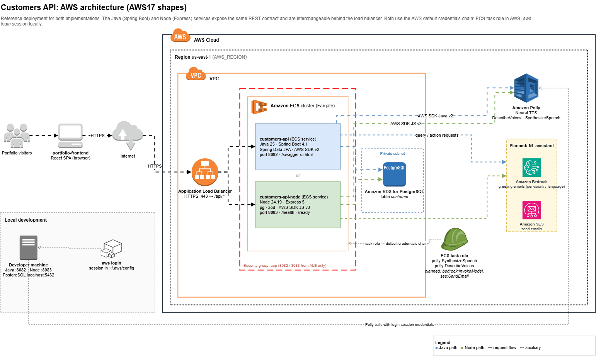
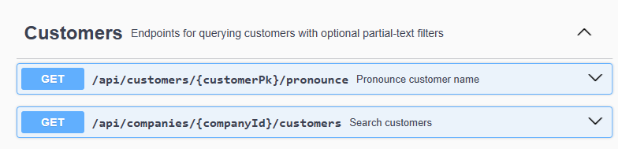
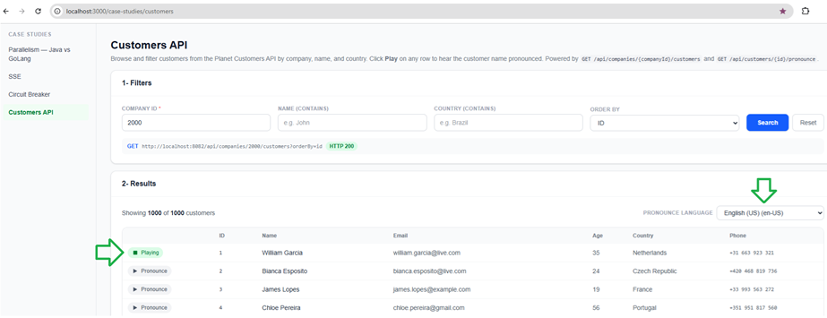
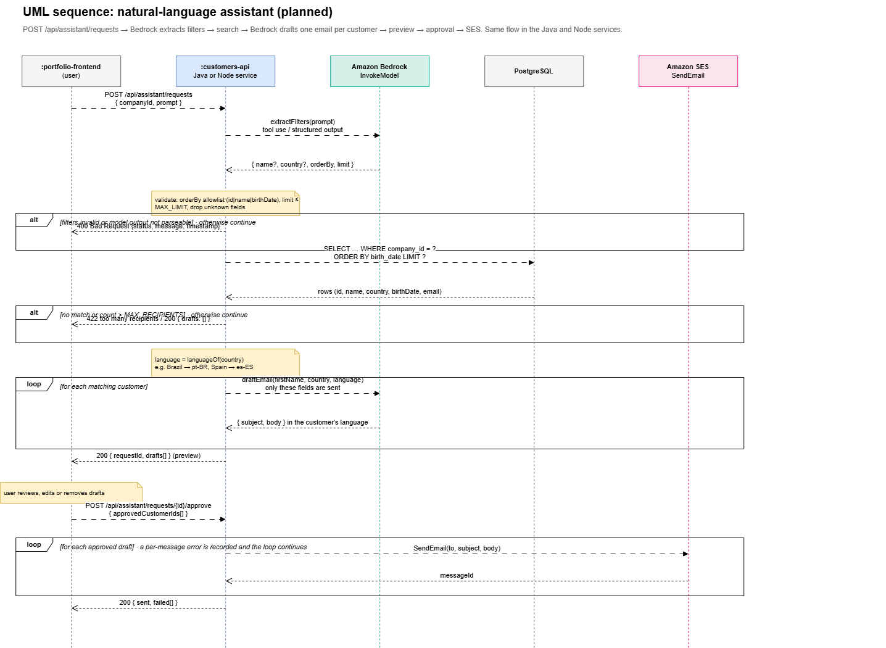
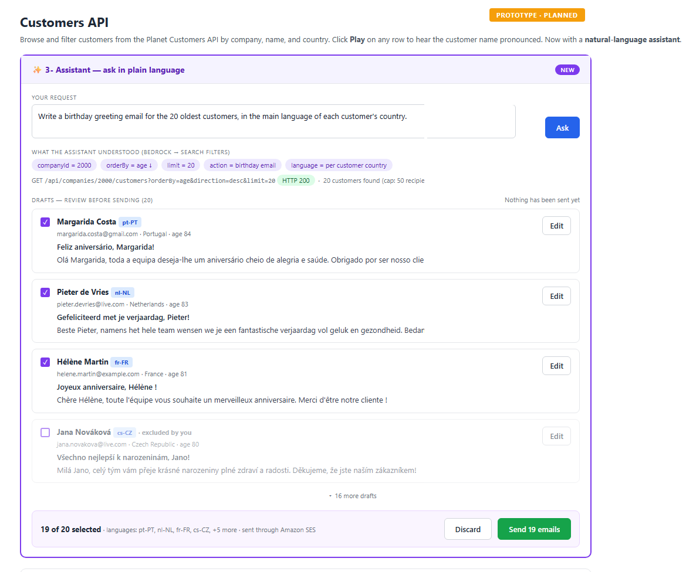

# Customers API

REST API for querying customers. Part of the [Mario Sérgio portfolio](https://github.com/mariosergio30/portfolio-frontend), backing the **Customers API** case study page.

## Technical Highlights
- **Explore the AWS AI and Machine Learning Services**
- **Amazon Polly (text to speech)**
- **Amazon Bedrock (natural language processing)**
- **SQL Full Text Search with PostgreSQL**

## Architecture


The frontend calls the Customers API, which queries PostgreSQL for customer data via `CustomerService`/`CustomerRepository`, and calls AWS Polly on demand via `PronounceService` to synthesize name pronunciations.
```
                        +----------------------------+
                        |     portfolio-frontend     |
                        |         (React UI)         |
                        +----------------------------+
                                       |
                                       | HTTP / JSON
                                       v

                        +----------------------------+
                        |     CustomerController     |
                        +----------------------------+
                                       |
                     +-----------------------------------+
                     |                                   |
                     v                                   v
        +------------------------+          +------------------------+
        |    CustomerService     |          |    PronounceService    |
        +------------------------+          +------------------------+
                     |                                   |
                     v                                   |
        +------------------------+                       |
        |   CustomerRepository   |                       |
        +------------------------+                       |
                     |                                   |
                     v                                   v
         +----------------------+             +--------------------+
         |      PostgreSQL      |             |     AWS Polly      |
         |   (CUSTOMER table)   |             |    (Neural TTS)    |
         +----------------------+             +--------------------+
```



---

### REST API



### Customers FRONT UI 

*The Customers case study page (from [portfolio-frontend](https://github.com/mariosergio30/portfolio-frontend)) consuming this API — search, filter, and pronounce customer names.*




## Features

- **Customer search** — list customers by company, with optional case-insensitive partial-text filters on `name` and `country`, and sorting by `id` or `name`.
- **Name pronunciation** — synthesizes "`{name} from {country}`" as MP3 audio via [AWS Polly](https://aws.amazon.com/polly/) Neural TTS, auto-selecting a native voice for the requested language.
- **OpenAPI / Swagger UI** documentation out of the box.

## Roadmap (planned)

**Natural-language customer assistant** — ask for customers in plain language and act on the result, e.g. *"write a birthday greeting email for the 20 oldest customers, in the main language of each customer's country"*.

1. **Understand** — [Amazon Bedrock](https://aws.amazon.com/bedrock/) (tool use / structured output) turns the request into the existing search filters (`name`, `country`, `orderBy`, plus a new `limit` and a `birthDate` sort). The database stays the source of truth and the model never sees the whole table.
2. **Search** — the service runs the normal customer search with those validated filters.
3. **Act** — Bedrock drafts one email per matching customer in the main language of the customer's country.
4. **Deliver** — [Amazon SES](https://aws.amazon.com/ses/) sends the emails, with a preview/approval step and a cap on recipients per request.

Both services (Java and Node) call Bedrock and SES through the ECS task role (`bedrock:InvokeModel`, `ses:SendEmail`). The request flow is shown below.



*Prototype of the planned assistant screen (mockup, not implemented yet):*



Open points: the schema needs a `birthDate` and an email address per customer, and a country → language mapping (a fixed lookup is more predictable than asking the model). Kendra was considered and dropped: it ranks text relevance and cannot sort or filter structured rows, and it is costly to run.

## Tech stack

- Java 25, Spring Boot 4.1
- Spring Web, Spring Data JPA, Spring Validation
- PostgreSQL
- Lombok
- springdoc-openapi (Swagger UI)
- AWS SDK v2 (Polly)

## API endpoints

| Method | Path | Description |
|---|---|---|
| `GET` | `/api/companies/{companyId}/customers` | Search customers by company, with optional `name`, `country`, `orderBy` (`id`\|`name`) query params. |
| `GET` | `/api/customers/{customerPk}/pronounce` | Synthesizes the customer's name via AWS Polly. Optional `language` query param (BCP‑47, e.g. `en-US`, `pt-BR`), defaults to `en-US`. Returns `audio/mpeg`. |
| `POST` | `/api/customers/{customerPk}/birthday-greetings` | Writes a birthday greeting with Amazon Bedrock. The model receives the customer's name and country and chooses the language (main language of the country) and the grammatical gender; the service sets a formality band from the age and does not send the exact age, email or phone. Returns `{ message, tone }`. |

Full interactive documentation is available at `/customers/swagger-ui.html` (the app runs under the `/customers` context path) once the app is running.

## Configuration

Configuration lives in [application.yml](src/main/resources/application.yml) and is overridable via environment variables:

| Variable | Default | Description |
|---|---|---|
| `SPRING_PROFILES_ACTIVE` | `local` | Active Spring profile. |
| `DB_HOST` | `localhost` | PostgreSQL host. |
| `DB_PORT` | `5432` | PostgreSQL port. |
| `DB_NAME` | `postgres` | PostgreSQL database name. |
| `AWS_REGION` | `us-east-1` | AWS region for Polly. |
| `AWS_POLLY_VOICE_ID` | `Joanna` | Default Polly voice (used as a fallback per language). |

AWS credentials for Polly are resolved in priority order: static `aws.polly.access-key` / `aws.polly.secret-key` if set in configuration, otherwise the default AWS credentials chain (env vars, `~/.aws/credentials`, `aws login`/SSO session, or an IAM role).

The server listens on port `8082` by default.

## Running locally

Prerequisites: JDK 25, Maven, and a PostgreSQL instance with a `CUSTOMER` table matching [Customer.java](src/main/java/com/mycompany/customersapi/domain/Customer.java).

```bash
./mvn spring-boot:run
```

The API will be available at `http://localhost:8082/customers`, with Swagger UI at `http://localhost:8082/customers/swagger-ui.html`.

To use the `/pronounce` endpoint, make sure valid AWS credentials with Polly access are available (see Configuration above);

## Project structure

```
src/main/java/com/mycompany/customersapi/
├── config/       # CORS, Jackson, OpenAPI, global exception handling
├── controller/    # REST endpoints
├── domain/        # JPA entities
├── dto/           # Request/response payloads
├── repository/    # Spring Data JPA repositories
└── service/       # Business logic, Polly TTS synthesis
```
